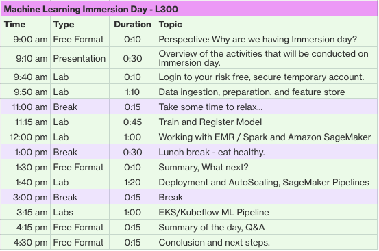

# ML Workshop - December 9th 2021


## Your temporary AWS account
Login to your account using this [guide](https://sagemaker-immersionday.workshop.aws/en/prerequisites/option1.html)

## Ingest, Prepare and Feature Store

Use the following command to clone the [workshop](https://github.com/data-science-on-aws/oreilly_book)
```
git clone https://github.com/data-science-on-aws/oreilly_book.git
```

## Breakout room for troubleshooting - https://chime.aws/4105144644

*Introduction*
Allocated time: 10 minutes
* <span style="color:purple">01_introduction/01_Setup_Dependencies.ipynb</span>.
* <span style="color:purple">01_introduction/02_Check_Environment.ipynb</span>.
* <span style="color:purple">01_introduction/03_Create_S3_Bucket.ipynb</span>.
* <span style="color:purple">01_introduction/04_Update_IAM_Roles_And_Policies.ipynb</span>.

Resources:
- [Dive deep into Amazon SageMaker Studio Notebooks architecture](https://aws.amazon.com/blogs/machine-learning/dive-deep-into-amazon-sagemaker-studio-notebook-architecture/)

*Ingest*
Allocated time: 20 minutes
* 04_ingest/00_Overview.ipynb
* 04_ingest/01_Copy_TSV_To_S3.ipynb
* 04_ingest/02_Create_Athena_Database.ipynb
* 04_ingest/03_Register_S3_TSV_With_Athena.ipynb
* 04_ingest/04_Convert_S3_TSV_To_Parquet_With_Athena.ipynb

*Explore*
Allocated time: 10 minutes
* 05_explore/00_Overview.ipynb
* <span style="color:purple">05_explore/01_Visualize_Reviews_Dataset.ipynb</span>.

*Prepare*
Allocated time: 30 minutes
* 06_prepare/00_Overview.ipynb
* <span style="color:purple">06_prepare/01_Prepare_Dataset_BERT_Scikit_AdHoc_FeatureStore.ipynb</span>. (10m)
  - It takes about 6 minutes for *data to be availabe in offline feature store* 
  - If you get any errors due to Athena limits, simply rerun the step.
What we do here?
1. Convert Raw Text to BERT Features using Hugging Face and TensorFlow
1. Add Features to SageMaker Feature Store
1. Ingest Records into Feature Store
1. Build Training Dataset and review using Athena
1. Review the Feature Store
1. Release Resources

* <span style="color:purple">06_prepare/02_Prepare_Dataset_BERT_Scikit_ScriptMode_FeatureStore.ipynb</span>. (20m)
  - The processing job takes 15 minutes to run
  - If you get any errors like ThrottlingException, simply rerun the step and it should work fine.

Resources:
- BERT
  - [BERT uncased](https://huggingface.co/bert-base-uncased)
  - [DistilBERT](https://huggingface.co/docs/transformers/model_doc/distilbert)
- [Feature Store](https://docs.aws.amazon.com/sagemaker/latest/dg/feature-store-getting-started.html)
- [Lineage Tracking](https://docs.aws.amazon.com/sagemaker/latest/dg/lineage-tracking.html)
- [SageMaker Experiments](https://docs.aws.amazon.com/sagemaker/latest/dg/experiments.html)

## Train, Model Registry, and Deployment and AutoScaling
*Train*
- 07_train/00_Overview.ipynb
- 07_train/01_Train_Reviews_BERT_Transformers_TensorFlow_AdHoc.ipynb
- 07_train/02_Train_Reviews_BERT_Transformers_TensorFlow_ScriptMode.ipynb

*Deploy*
- 09_deploy/00_Overview.ipynb
- 09_deploy/03_Deploy_Reviews_BERT_TensorFlow_REST_Endpoint.ipynb
  - Takes 20 minutes to create the endpoint
- 09_deploy/04_Autoscale_Reviews_BERT_TensorFlow_REST_Endpoint.ipynb

## SageMaker Pipelines, EKS/Kubeflow ML Pipeline
*Pipeline*
- 10_pipeline/00_Overview.ipynb
- 10_pipeline/01_Create_SageMaker_Pipeline_BERT_Reviews.ipynb
  - The pipeline execution takes 42 minutes.
- 10_pipeline/05_Register_Deploy_Model.ipynb
- 10_pipeline/kubeflow
  - 10_pipeline/kubeflow/00_00_Setup_EKS.ipynb
    - In step 3 - Create EKS cluster, replace the --version 1.17 with --version 1.18

  - 10_pipeline/kubeflow/00_01_Configure_Environment.ipynb
  - 10_pipeline/kubeflow/00_02_Create_S3_Bucket.ipynb
  - 10_pipeline/kubeflow/00_03_Setup_Kubeflow.ipynb
  - 10_pipeline/kubeflow/00_04_Setup_Kubeflow_EKS_Credentials.ipynb
  - 10_pipeline/kubeflow/00_05_Launch_Kubeflow_Jupyter_Notebook.ipynb
  - 10_pipeline/kubeflow/00_06_Explore_Kubernetes_Cluster.ipynb
  - 10_pipeline/kubeflow/00_07_SWITCH_TO_KUBEFLOW_NOTEBOOK.ipynb
  - 10_pipeline/kubeflow/01_Kubeflow_Intro.ipynb
  - 10_pipeline/kubeflow/02_Kubeflow_Pipeline_Simple.ipynb
  - 10_pipeline/kubeflow/03_Kubeflow_Pipeline_Reviews_BERT_SageMaker.ipynb

    - Update the last cell of 03_Kubeflow_Pipeline_Reviews_BERT_SageMaker.ipynb with following code.
        ```
        import json
        inputs = {"features": ["This is great!"]}
        response = sm_runtime.invoke_endpoint(
            EndpointName=endpoint_name,
            ContentType="application/jsonlines",
            Accept="application/jsonlines",
            Body=json.dumps(inputs).encode("utf-8")
        )
        print("response: {}".format(response))
        predicted_classes_str = response["Body"].read().decode()
        predicted_classes_json = json.loads(predicted_classes_str)
        predicted_classes = predicted_classes_json['predicted_label']
        print("\n predicted_classes: {}".format(predicted_classes))
        ```

  - 10_pipeline/kubeflow/04_Distributed_Training.ipynb
  - 10_pipeline/kubeflow/05_Hyper_Parameter_Tuning.ipynb

